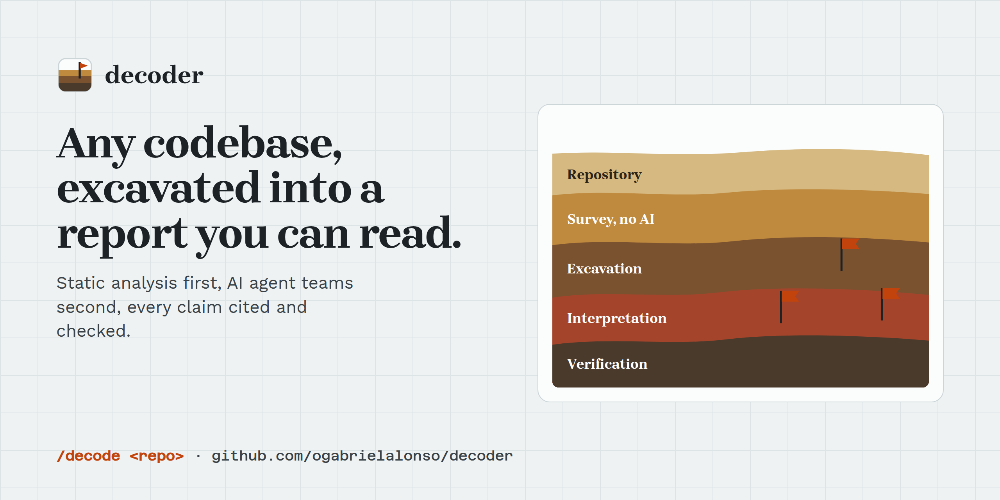
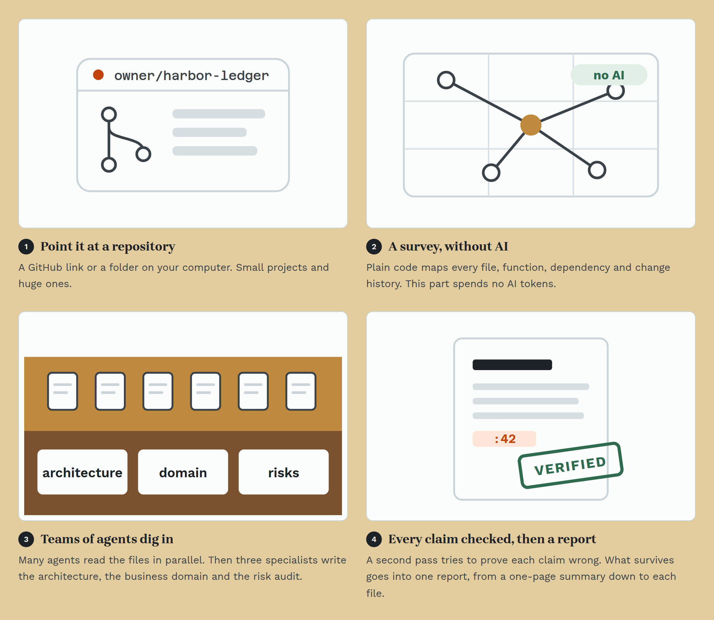
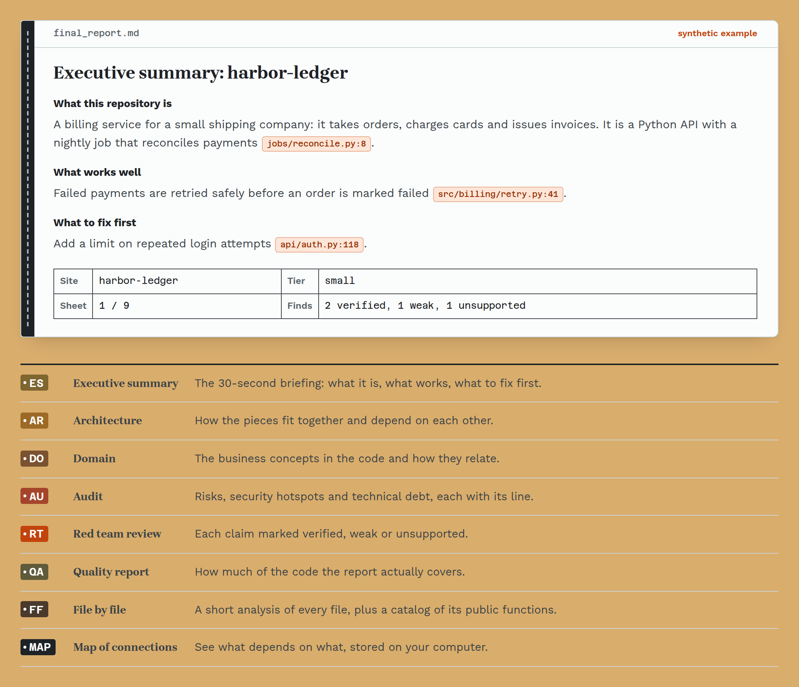
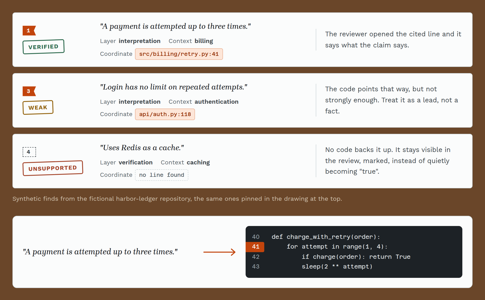
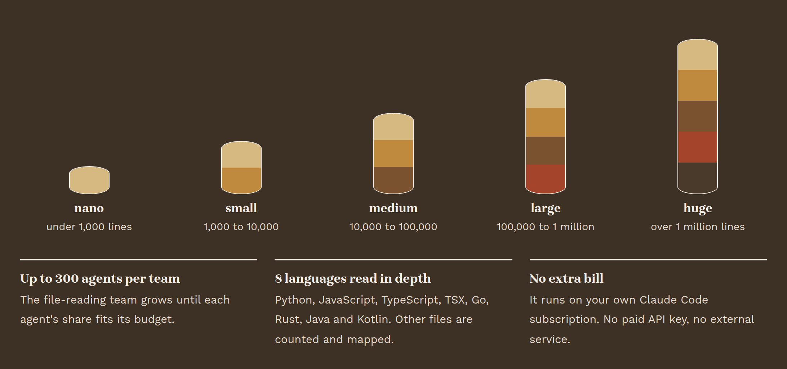
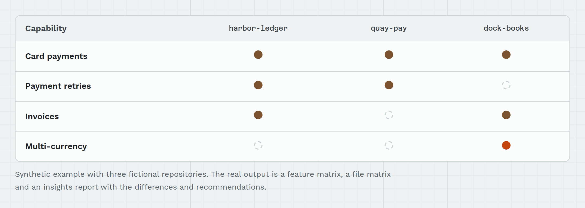

<p align="center">
  <picture>
    <source media="(prefers-color-scheme: dark)" srcset="docs/assets/banner-dark.png">
    
  </picture>
</p>

<p align="center">
  <a href="LICENSE.md"></a>
  
  <a href="tests/"></a>
  
  
</p>

<h1 align="center">decoder</h1>

<p align="center">
  Point it at a repository and get back a report you can actually read: what the code does,<br>
  how it is built and where the risks are. Every claim points to the exact line of code,<br>
  and a second pass tries to prove each one wrong.
</p>

<p align="center">
  <a href="https://decoder-dev.vercel.app"><b>Project page (English and Portuguese)</b></a> ·
  <a href="#get-started">Get started</a> ·
  <a href="#for-engineers">For engineers</a> ·
  <a href="#license">License</a>
</p>

## In one minute

<picture>
  <source media="(prefers-color-scheme: dark)" srcset="docs/assets/readme/minute-dark.png">
  
</picture>

Ordinary code does the discovery first, at zero AI tokens: every file, function, dependency and
change in the history is mapped before any agent starts. The agents then write on top of those
facts instead of guessing.

## What you get

<picture>
  <source media="(prefers-color-scheme: dark)" srcset="docs/assets/readme/report-dark.png">
  
</picture>

One folder per repository, `docs/decode/<name>/`, opening on `final_report.md`: a 30-second
executive summary on top, then architecture, domain, audit, a red team review of the claims, a
quality report, a short analysis of every file and a map of what depends on what.
*The example above is synthetic: harbor-ledger is a fictional repository.*

## Every claim is cited, then challenged

<picture>
  <source media="(prefers-color-scheme: dark)" srcset="docs/assets/readme/claims-dark.png">
  
</picture>

AI can sound sure and still be wrong. So each sentence in the report carries the file and line
it came from, and a separate reviewer opens that line and marks the claim **verified**, **weak**
or **unsupported**. Unsupported claims stay visible, flagged, instead of quietly becoming facts.

## From small projects to huge ones

<picture>
  <source media="(prefers-color-scheme: dark)" srcset="docs/assets/readme/scale-dark.png">
  
</picture>

The team that reads the files grows with the repository, up to 300 agents per team, so each
agent's share always fits its budget. Python, JavaScript, TypeScript, TSX, Go, Rust, Java and
Kotlin are read in depth; other files are counted and mapped.

## Compare two to four repositories

<picture>
  <source media="(prefers-color-scheme: dark)" srcset="docs/assets/readme/compare-dark.png">
  
</picture>

`/decode-compare` decodes each repository, lines them up in a feature matrix and a file matrix,
and writes an insights report: where they converge, where they differ and what one could borrow
from another.

## Who it is for

- **Inheriting a codebase:** a new team, an acquisition, a client project you did not write.
- **Choosing between options:** compare two to four repositories before you commit to one.
- **Due diligence and audits:** a first map of risks and technical debt, each with its line.
- **Onboarding:** a readable tour of a large project for someone joining it.

It runs on your own Claude Code subscription (Codex is optional): no paid API key and no
external service.

## Get started

You need two free tools: **Python 3.12 or newer** and **Claude Code**, signed in to your account.
Not technical? Hand steps 1 and 2 to a developer; step 3 is the part you read.

**1. Install.** Paste these into the terminal, one at a time. They download decoder and install
it in its own folder, without touching the rest of your computer.

```bash
git clone https://github.com/ogabrielalonso/decoder.git && cd decoder
python -m venv .venv
.venv/bin/pip install -e ".[analysis,knowledge,dev]"
```

**2. Decode a repository.** Open Claude Code inside the `decoder` folder and type:

```
/decode https://github.com/owner/repo
```

It runs every stage on its own: the survey, the agent teams, the quality check, the second pass
and the report. A local folder works too.

**3. Read the report.** Open `docs/decode/<name>/final_report.md` and start with the executive
summary.

---

## For engineers

### How it works

Phase 0 (ingestion, static analysis, orchestration planning) is deterministic code and costs
zero tokens: tree-sitter parsing, a dependency graph, git history, a security pre-scan and graph
metrics (coupling, god-modules, churn hotspots). Team Alpha then fans out N parallel workers to
describe every file; Bravo, Charlie and Delta each run one synthesis worker that reads Alpha's
output and writes the architecture, domain and audit documents. QA scores coverage and the red
team classifies each claim as verified, weak or unsupported; the synthesizer assembles the final
report and the executive summary. Full internals: [docs/architecture.md](docs/architecture.md).

```
ingestion ─▶ static analysis ─▶ plan ─▶ Alpha (N workers) ─▶ Bravo ─▶ Charlie ─▶ Delta
                                                                                  │
               final_report.md ◀─ executive summary ◀─ synthesis ◀─ red team ◀─ QA
```

Repository size sets the tier by lines of code: nano, small (1,000 to 10,000), medium (10,000 to
100,000), large (100,000 to 1,000,000) and huge (above 1,000,000). Adaptive scaling adds Alpha
workers to hold a fixed per-worker token budget, up to 300 per team, favoring directory locality
when it splits the files.

### Install extras

The install in [Get started](#get-started) pulls three optional groups:

- `analysis`: tree-sitter, GitPython and networkx
- `knowledge`: ChromaDB and sentence-transformers (100% local embeddings)
- `dev`: pytest, ruff and mypy

### Ways to run it

- **`/decode <source>` in Claude Code (recommended):** the whole pipeline. Static analysis, the
  auto-sized plan, Alpha in parallel through the `decode-execute` workflow, Bravo, Charlie, Delta,
  QA with self-healing of weak modules, the red team, synthesis and the executive summary.
  Output: `docs/decode/<slug>/final_report.md`.
- **`decoder execute <source>`:** static analysis and the four teams as headless, read-only
  `claude -p` (or `codex exec`) subprocesses; the calling conversation spends effectively no
  tokens. Output: `docs/decode/<slug>/index.md` and the architecture, domain and audit documents.
- **`decoder decode <source>`:** the plan and the static artifacts only (`plan.json`); step 1 of
  `/decode`.
- **`/decode-compare <a> <b> [<c>] [<d>]` in Claude Code:** the full `/decode` flow for each
  repository, one at a time, then the matrices and the insights report, under
  `docs/compare/<joined_slug>/`.

`<source>` is a GitHub URL or a local path. After `decoder execute`, QA and synthesis are
separate commands:

```bash
decoder qa run <slug>                        # coverage and validation
decoder synthesize <slug>                    # final_report.md + api_catalog.md
decoder qa red-team-prompt <slug>            # red team prompt, for an agent to run
decoder synthesize <slug> --executive-prompt # executive summary prompt, for an agent to run
```

<details>
<summary><b>Flags, knowledge queries, model bake-off and budget</b></summary>

<br>

Flags shared by `decode` and `execute`:

- `--static-only`: stop after static analysis.
- `--plan-only`: print the plan JSON to stdout (what the skill consumes).
- `--workers N`: override Team Alpha's worker count.
- `--target-tokens N` / `--alpha-target-tokens N`: per-worker token budget (default 120000 for
  `decode`, 12000 for `execute`); adaptive scaling expands the worker count to hold it.
- `--index-vectors` (`decode` only): also index symbols in ChromaDB (downloads the local
  embedding model on first run).
- `--no-history`: skip git history analysis.
- `--synth-executor codex` (`execute`): run the synthesis workers on Codex.

Compare, from the CLI (static side only):

```bash
decoder decode-compare <source_a> <source_b> [<source_c>] [<source_d>]
```

Writes `summary.md`, `feature_matrix.md` (`(kind, name) × repo`), `structure_matrix.md` (files
grouped by coverage) and `insights_prompt.md` under `docs/compare/<joined_slug>/`.

Knowledge layer: a SQLite dependency graph is filled on every decode; `--index-vectors` adds a
ChromaDB index with local embeddings (`BAAI/bge-small-en-v1.5`).

```bash
decoder knowledge status <slug>
decoder knowledge neighbors <slug> src/main.py --depth 2
decoder knowledge search <slug> "semantic query"   # needs --index-vectors
```

Model bake-off: runs each candidate model on the same Alpha and Bravo workers, scores the output
against the Opus gold standard (accuracy, completeness, insight, hallucinations) plus
deterministic floor checks, and emits a ranked matrix. This is how each worker's default model
gets picked: measured, not guessed.

```bash
decoder eval-models <source> --runs 3
decoder budget <slug>
```

</details>

### Project structure

```
decoder/
├── ingestion/         clone, metrics, tier
├── static_analysis/   tree-sitter, symbols, dependency graph, git history, security pre-scan
├── orchestration/     master, chunker, budget, event bus, prompts
├── execution/         headless CLI workers (claude -p / codex exec) and the bake-off harness
├── knowledge/         embeddings, vector store, graph store, markdown writer
├── qa/                coverage, validator, red team, runner
├── synthesis/         module structure, assembler, API catalog, executive prompt
├── compare/           alignment, matrix, insights, pipeline
└── utils/             logging
.claude/
├── commands/          /decode and /decode-compare (Claude Code)
└── workflows/         decode-execute (parallel worker fan-out)
```

### Stack

- **Python 3.12+**, `typer` and `rich` for the CLI
- **tree-sitter-language-pack**: Python, JavaScript, TypeScript, TSX, Go, Rust, Java, Kotlin
- **networkx** and **SQLite**: persisted dependency graph
- **ChromaDB** (embedded) and **sentence-transformers** (`BAAI/bge-small-en-v1.5`): local vectors
- **GitPython**: clone and history
- **pydantic**: contracts between the library and the skills and executors

### Costs

**Zero external cost.** No embeddings API, no managed database, no remote service. Workers run
through your own Claude Code (and optionally Codex) subscription rather than a metered API key;
the only limit is your subscription's usage quota.

### Tests

```bash
.venv/bin/python -m pytest -q
```

156 tests covering ingestion, static analysis, orchestration, the execution layer, the knowledge
layer, QA, budget, synthesis and compare. `ruff check` and `mypy` are both clean.

### Status

- **v1.1.0**: `/decode-compare` compares 2 to 4 repositories with a feature matrix and a
  consolidated insights report; the `/decode` and `/decode-compare` commands ship in `.claude/`.
- Also in this line: `decoder execute` (static analysis and the four teams as headless
  subprocesses), the evidence-based model bake-off, deterministic synthesis metrics injected into
  worker prompts, and Java and Kotlin static analysis.
- Known limits ([docs/architecture.md](docs/architecture.md)): fuzzy file matching in compare is
  filename-only, and token counting is heuristic.
- Roadmap: more languages (Swift, C#, Scala), optional Neo4j, background execution.

## License

[PolyForm Noncommercial 1.0.0](LICENSE.md): free for personal use, study and noncommercial
organizations. Commercial use needs a separate license.

<p align="center">
  <br>
  Made by <b>Gabriel Alonso</b><br>
  <a href="https://github.com/ogabrielalonso">GitHub</a> · <a href="https://www.linkedin.com/in/ogabrielalonso/">LinkedIn</a> · <a href="https://decoder-dev.vercel.app">Project page</a>
</p>
